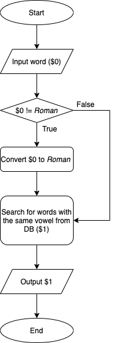

# eustomy
Return words with the same vowel.
  
## Docker
  
### Version

```bash
> docker --version
Docker version 19.03.12, build 48a66213fe

> docker-compose --version
docker-compose version 1.27.2, build 18f557f9
```
  
### Build
  
```bash
> docker-compose up --build -d
```
  
### Run
  
```bash
> docker-compose exec app go mod download && go run main.go
```
## Flowchart
  

  